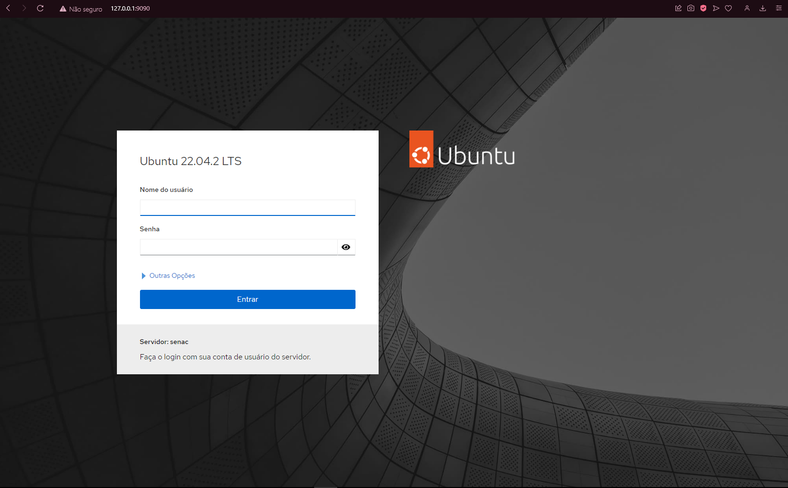

# Documentação da atividade da UC10
### Aqui vai ser apresentado a instalação e a utilização das aplicações do cockpit, docker, docker-compose, wordpress, adminer e mysql usadas no sistema Linux Ubuntu Server 22.04.

----


----

## Instalação cockpit

Cockpit é uma interface de administração de servidor interativa. É fácil de usar e muito leve. O Cockpit interage diretamente com o sistema operacional a partir de uma sessão real do Linux em um navegador. Pode ser instalado em muitos sistemas operacionais Linux, incluindo Debian, Fedora e RHEL.

Para instalarmos primeiramente você terá que atualizar seu sistema usando.
No meu caso usarei o comando de atualização do Ubuntu. 

```
sudo apt-get update
```
Depois de atualizar o sistema temos que colocar esse comando para baixar e instalar o cockpit. 

```
sudo apt-get install cockpit
```
Após a instalação do cockpit temos que ver a versão instalada e o status dele no sistema.
```
cockpit --version

systemctl status cockpit
```
Caso systemctl aponte que o cockpit esteja desligado (dead) terá que usar o seguinte comando:
```
systemctl start cockpit
```
Depois disso o terminal vai pedir a autenticação do usuario login e senha do sistema pra ele executar e ligar a aplicação.

Para usar o cockpit você terá que colocar  no seu navegador https://seu_ip:9090 e aparecerá essa tela e tem que colocar o seu login da 
maquina virtual:

---



---

## Instalação do Docker

O Docker é um software de código aberto usado para implantar aplicativos dentro de containers virtuais. A conteinerização permite que vários aplicativos funcionem em diferentes ambientes complexos. Por exemplo: o Docker permite executar o WordPress em sistemas Windows, Linux e macOS, sem problemas.

Depois de sabermos o intuito do docker e suas funcionalidades, agora vamos instala-lo

Primeiramente devemos atualizar o sistema com o comando que já foi dito na instalação do cockpit, temos que baixar as dependências dele com esse comando:

```
sudo apt-get install apt-transport-https ca-certificates curl gnupg lsb-release
```

Agora temos que acionar a chave oficial do Docker no sistema com o seguinte comando:

```
curl -fsSL https://download.docker.com/linux/ubuntu/gpg | sudo gpg --dearmor -o /usr/share/keyrings/docker-archive-keyring.gpg
```

Adicione o repositorio do Docker às fontes APT com este comando:

```
echo "deb [arch=amd64 signed-by=/usr/share/keyrings/docker-archive-keyring.gpg] https://download.docker.com/linux/ubuntu $(lsb_release -cs) stable" | sudo tee /etc/apt/sources.list.d/docker.list > /dev/null
```

Agora temos que atualizar o sistema novamente e depois de reiniciar coloque esse comando para a instalação do Docker Engine

```
sudo apt-get install docker-ce docker-ce-cli containerd.io
```

Após isso o Docker foi instalado com sucesso, para certificar que o Docker foi instalado com sucesso execute esse o comando a baixo e se ele tiver no "running" em verde ele está funcionando corretamente

```
systemctl status docker
```

Agora temos que colocar o usuario no mesmo grupo que o Docker pra quando mexermos nele não precisarmos da autorização do sudo sempre use esse comando para adicionar eles no mesmo grupo:

```
sudo usermod -aG docker $USER
```

---

## Instalação do Docker Compose

Para começarmos a instalação  do Docker compose coloque este comando: 

```
sudo curl -L "https://github.com/docker/compose/releases/download/1.29.2/docker-compose-$(uname -s)-$(uname -m)" -o /usr/local/bin/docker-compose

```

Agora temos que dar permissão ao Docker Compose com esse comando: 

```
sudo chmod +x /usr/local/bin/docker-compose
```

Após instalar temos que ver se está instalado corretamente use o esse comando para ver a versão que está o Docker compose:

```
docker-compose --version
```

---

## Adicionando as aplicações

Depois de instalar o docker e o docker compose temos que adicionar as aplicações que vão ser usadas que nesse caso vou usar o mysql, adminer e o wordpress.

Temos que ir para o site do docker hub clicar no espaço de pesquisa do site, coloca o nome da aplicação clique na documentação oficial com um selo verde de verificado, copia o codigo pull como exemplo "pull mysql" ai vc cola ele no terminal do seu sistema e dá ENTER que vai iniciar a instalação das aplicações.

No meu caso teria que usar os seguites códigos:

```
pull mysql
```

```
pull adminer
```

```
pull wordpress
```

---

## Configurando o docker compose

Para a configuração do docker compose temos primeiro criar um touch chamado docker-compose.yml com o seguinte comando:

```
touch docker-compose.yml
```

Após a criação do touch temos que altera-lo abrindo ele com o vim e adicionando dentro dele os seguintes códigos:

```
version: '3.1'
services:
  db:
    image: mysql:latest
    restart: always
    environment:
      MYSQL_ROOT_PASSWORD: senac123
      MYSQL_DATABASE: site
    ports:
      - '6556:3306'
    volumes:
      - ~/site-db:/var/lib/mysql
    expose:
      - '3306'
  wordpress:
    image: wordpress
    restart: always
    environment: 
      WORDPRESS_DB_USER: root
      WORDPRESS_DB_PASSWORD: senac123
      WORDPRESS_DB_NAME: site
      WORDPRESS_TABLE_PREFIX: ps
    ports:
      - '8084:80'
    volumes:
      - ~/site-wordpress:/var/www/html

  adminer:
    image: adminer
    restart: always
    ports:
      - '8085:8080'
```

No meu caso eu determinei a porta e o nome das pastas de cada uma das aplicações. 

*CUIDADO PARA NÃO ERRAR NO ALINHAMENTO DOS CÓDIGOS PARA NÃO DAR NENHUM ERRO.*

Após salvar o código crie as pastas que vc determinou no docker compose com o seguinte código:

```
mkdir "nome_da_pasta"
```

Depois disso use o comando para rodar as aplicações:

```
docker-compose up
```

Após isso o terminal vai ficar travado e terá que fazer o logout para destravar ele para prosseguir.

Agora para testar as aplicações se deve colocar em seu navegador https://seu_ip:porta_definida
no meu caso a porta que defini foi Adminer: 8085, MySQL: 6556, wordpress: 8084.

E em todos os sites das aplicações irá pedir login e senha que você determinou na configuração do docker-compose.yml.

---

## Criação do site 

Após você colocar o login no wordpress vc terá que ir na aba de aparecencias e selecionar uma pré pronta e editar e personalizar o jeito que preferir, eu fiz um site de venda de roupas de grife bem básico para demonstrar a utilidade do site 

Imagem do site abaixo:


---
